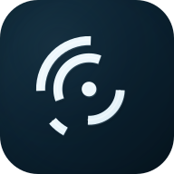
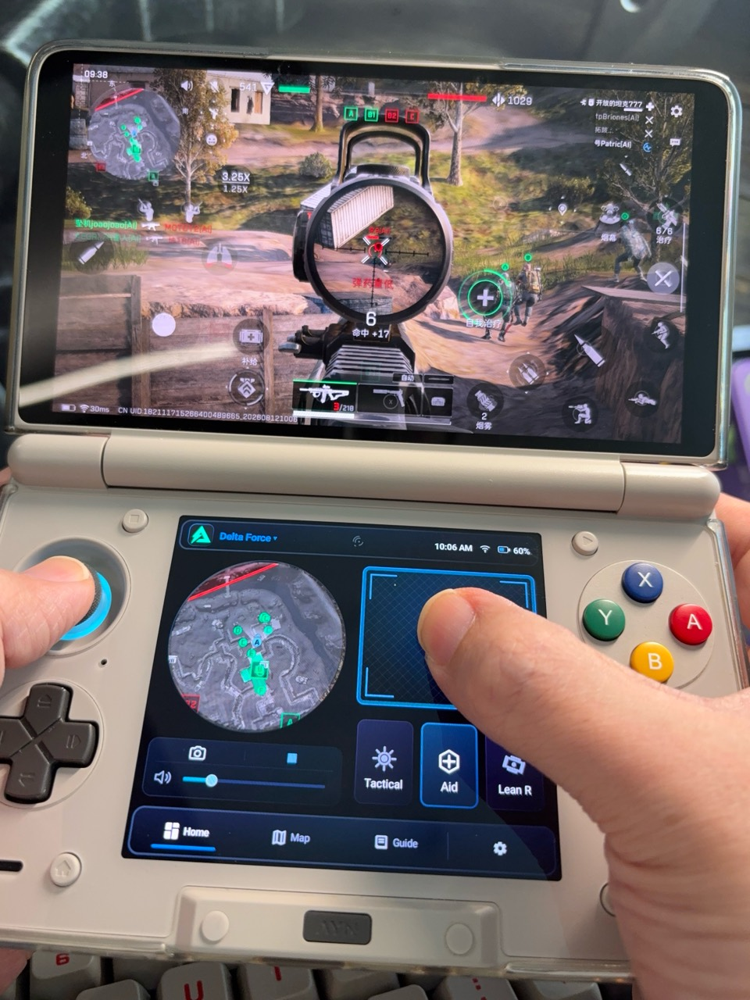
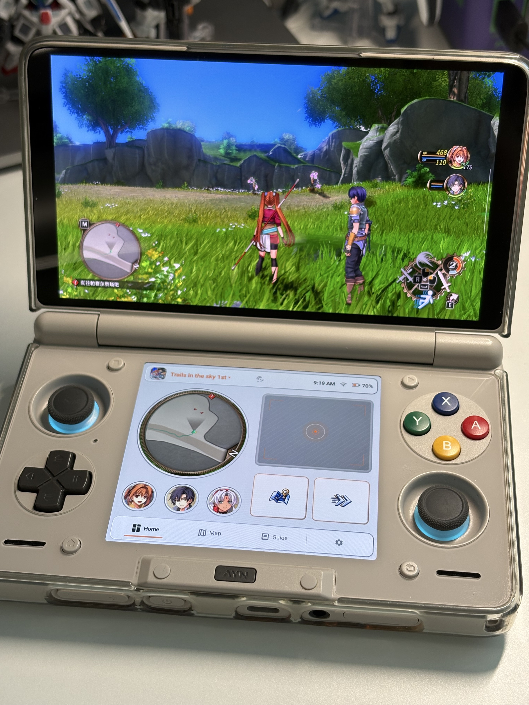
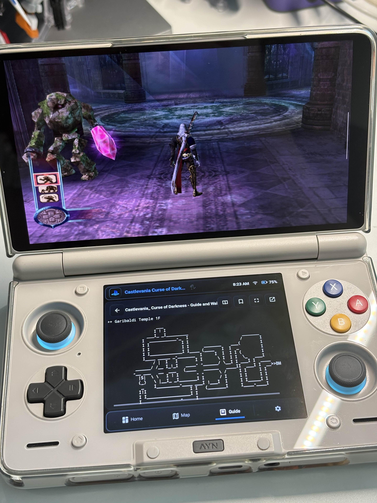
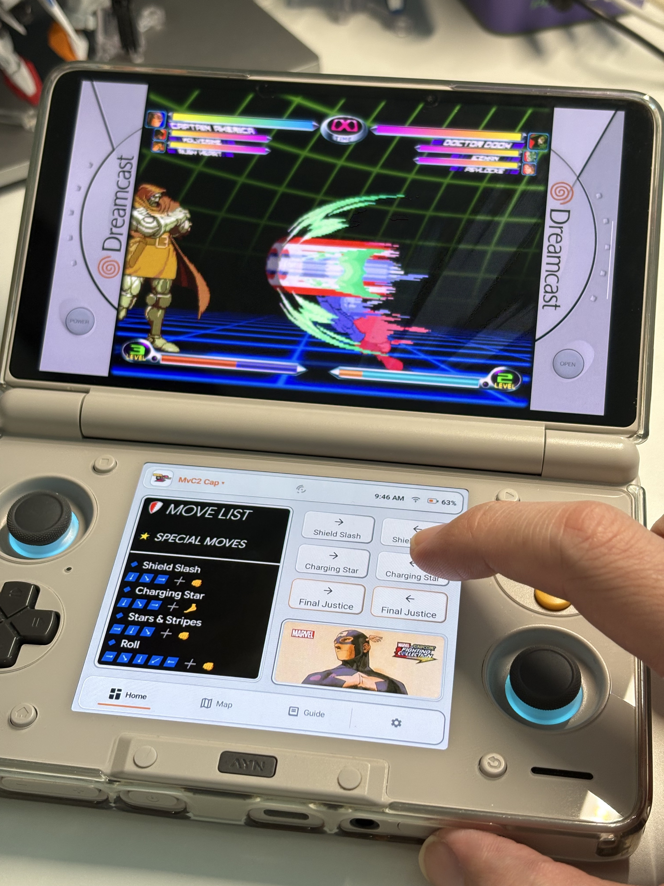
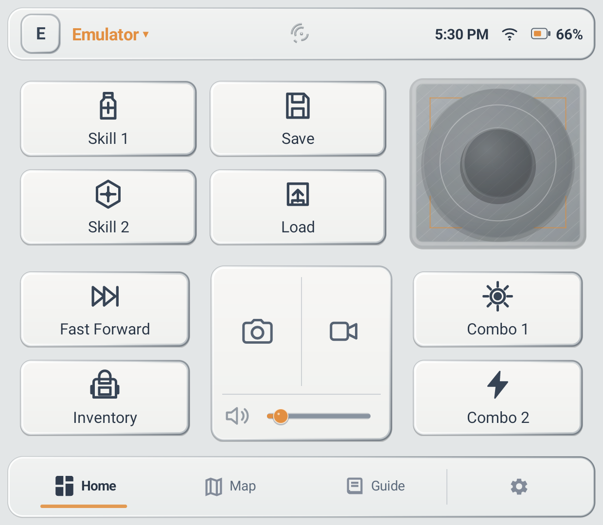
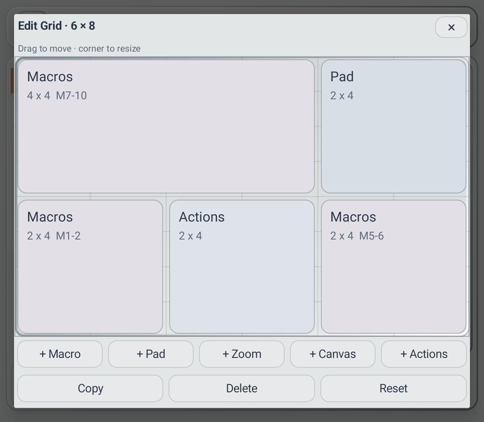

<p align="center">
  
</p>

<h1 align="center">Heimdall</h1>

<p align="center">
  An open-source lower-screen game assistant built for AYN Thor.
</p>

<p align="center">
  <a href="https://github.com/mastercook777/Heimdall-AYN-Thor-Assistant/releases"><strong>Download Alpha</strong></a>
  · <a href="docs/guides/Heimdall-Installation-Guide-en.pdf"><strong>English PDF Guide</strong></a>
  · <a href="docs/guides/Heimdall-Installation-Guide-zh-CN.pdf"><strong>简体中文 PDF 指南</strong></a>
  · <a href="https://github.com/mastercook777/Heimdall-AYN-Thor-Assistant/issues">Report an issue</a>
</p>

English | [简体中文](README.zh-CN.md)

Heimdall keeps the game on Thor's upper screen while the lower screen becomes a persistent control and reference console: Profiles, macros, touch controls, maps, guides, static-image Canvases, magnification, recording, and Quick Actions stay within thumb reach.

> **Alpha software:** Heimdall targets AYN Thor. Compatibility is not guaranteed for every Thor firmware, controller mode, game, emulator, or other dual-screen device.

## Heimdall On A Real AYN Thor

<table>
  <tr>
    <td width="50%"></td>
    <td width="50%"></td>
  </tr>
  <tr>
    <td align="center"><strong>Active play:</strong> Precision Aim and circular magnification</td>
    <td align="center"><strong>Profile controls:</strong> magnifier, touchpad, and Macros</td>
  </tr>
  <tr>
    <td width="50%"></td>
    <td width="50%"></td>
  </tr>
  <tr>
    <td align="center"><strong>Reference:</strong> a local Guide without covering the game</td>
    <td align="center"><strong>Execution:</strong> Canvas move list and structured Macros</td>
  </tr>
</table>

## What You Can Do

| Area | What Heimdall provides |
| --- | --- |
| Profiles and Grid | Separate game layouts, App bindings, touch settings, maps, guides, and Canvases. Drag and resize modules on a visible 6 x 8 Grid, then save explicitly. |
| Macros | Structured tap, hold, swipe, wait, and physical-controller sequences. No free-form command editing is required. |
| Touch and aiming | Basic Touch, touchpad drag, Virtual Right Stick, Precision Aim, and mapping-compatible Shizuku Touch when the required route is available. |
| Reference tools | Local maps, PDFs, guides, Interactive Map links, and multiple independent static-image Canvases per Profile. |
| Upper-screen tools | Screenshot, screen recording, and one live region magnifier per Profile. |

<table>
  <tr>
    <td width="50%"></td>
    <td width="50%"></td>
  </tr>
  <tr>
    <td align="center"><strong>Play view:</strong> controls stay glanceable on the lower screen</td>
    <td align="center"><strong>Edit view:</strong> drag modules and resize from visible corners</td>
  </tr>
</table>

## Start Here: Choose Only What You Need

**Installing Heimdall does not require root or Developer options.** Developer options are needed only if you want to start Shizuku for advanced controller features.

| What you want to use | Required setup |
| --- | --- |
| Profiles, Grid, maps, guides, Canvas, and normal UI | Install Heimdall only. No Developer options or Shizuku required. |
| Upper-screen taps, holds, swipes, and compatible touchpad drag | Enable the Heimdall Accessibility service for **Basic Touch**. |
| Physical-controller recording/replay, Virtual Right Stick, Precision Aim, or mapping-compatible Enhanced Touch | Install, start, and authorize **Shizuku**. This route needs Developer options for wireless debugging. |
| Live magnifier or screen recording | Accept Android's screen-capture consent when Heimdall requests it. |

You do not need to enable every permission during first launch. Start with one Profile and one route, test it, then add features as needed.

## 1. Download And Install

1. Open the [Heimdall Releases page](https://github.com/mastercook777/Heimdall-AYN-Thor-Assistant/releases).
2. Open the newest versioned Alpha release.
3. Download the file named like `heimdall-vX.Y.Z-alpha.N.apk`. The same release also includes `SHA256SUMS.txt` for file verification.
4. Open the APK with Thor's file manager.
5. If Android asks, allow that file manager to **install unknown apps**, return to the installer, and finish installation.
6. Open Heimdall.

Install only immutable, versioned releases from this repository. The mutable private-development `debug-latest` channel is not a public release, and re-signed APKs from unknown sources should not be trusted.

### Updating Or Moving From An Older Test Build

Official Alpha updates signed with the same release identity can normally install over the previous public Alpha. Do not uninstall first unless the release notes explicitly require it: uninstalling removes local Profile data and imported assets.

Older test packages and new Debug builds may be separate Apps and do not share data with the public package `com.mastercook777.heimdall`.

Before moving from an older test build:

1. Open Profile management in the old build.
2. Export all Profiles and keep the exported file somewhere easy to find.
3. Install and open the public Alpha.
4. Re-authorize the services you use.
5. Import the exported file and confirm the important Profiles before deleting the old build or backup.

Older builds export configuration-only JSON, which remains importable but cannot recover missing external assets. Current builds export a self-contained `.heimdall-profile` bundle containing Profile data plus supported Profile icons, maps, file Guides, user Macro icons, and Canvas images.

## 2. Create Your First Profile

1. Open **Settings > Profile management**.
2. Create a Profile for one game or emulator.
3. Start the target App on the upper screen, then bind it from Heimdall's recent-App selector.
4. Choose a Grid preset. **Balanced** is the easiest starting point; **Controls** reserves more room for touch controls, and **Macros** shows more actions.
5. Add only the modules you want now.
6. Tap **Save** at the bottom of Settings.
7. Switch back to the game and confirm Heimdall selects the expected Profile.

> **Save boundary:** Grid and several Profile settings use preview/draft state. Seeing the preview does not mean it has been stored; save before leaving the editor or Settings.

## 3. Enable Basic Touch (Optional)

Basic Touch sends compatible taps, holds, swipes, and touchpad drags to the upper screen through Android Accessibility. It does not require Shizuku or Developer options.

1. Open **Settings > Connection** in Heimdall.
2. Choose **Basic Touch** and tap its enable action.
3. In Android Accessibility settings, find Heimdall, read the system warning, and enable the service.
4. Return to Heimdall and confirm Basic Touch is available.
5. Test one simple tap macro or touchpad movement before building a longer macro.

> Basic Accessibility touch and Thor's built-in mapper use separate touch streams and may cancel each other when used simultaneously. If coexistence is required, use the mapping-compatible Enhanced Touch route only when Heimdall reports it as available.

## 4. Set Up Shizuku For Controller Enhancement (Optional)

Shizuku is needed for physical-controller recording/replay, Virtual Right Stick, Precision Aim, and mapping-compatible Enhanced Touch. Heimdall does not require root.

- [Shizuku official releases](https://github.com/RikkaApps/Shizuku/releases)
- [Shizuku official setup guide](https://shizuku.rikka.app/guide/setup/)

### Never Enabled Developer Options Before?

Android menu names can vary slightly by Thor firmware. If a named page is hard to find, use the search box in Android Settings for **Build number**, **Developer options**, or **Wireless debugging**.

1. Open Thor's **Android Settings**.
2. Open **About device**, **About handheld**, or a similarly named page.
3. Find **Build number**. On some firmware it may be inside a software/version details page.
4. Tap **Build number seven times**.
5. Enter the screen-lock PIN if Android asks. A message should confirm that Developer options are enabled.
6. Go back to **System > Developer options**, or search Settings for **Developer options**.
7. Enable **USB debugging**.
8. Open **Wireless debugging** and turn it on.

Developer options are now available. You normally do not need to repeat these eight steps.

### Pair And Start Shizuku

1. Install and open Shizuku.
2. Choose **Start via wireless debugging**, then start pairing.
3. Return to Android's **Wireless debugging** page.
4. Choose **Pair device with pairing code**.
5. Enter the displayed code in Shizuku's notification or pairing screen.
6. Return to Shizuku, tap **Start**, and wait for it to report that Shizuku is running.
7. Open **Heimdall > Settings > Connection > Controller Enhancement**.
8. Tap the authorize/connect action and allow Heimdall in the Shizuku permission dialog.
9. Return to Heimdall and confirm Controller Enhancement is available.

After restarting Thor, check Shizuku before using controller features. If it is no longer running, start it again; pairing normally does not need to be repeated.

If Shizuku stays on "Searching for pairing service," allow it to run in the background, enable its notifications, keep local networking and wireless debugging available, and try turning wireless debugging off and on once. See the [official Shizuku troubleshooting guide](https://shizuku.rikka.app/guide/setup/) for current platform-specific advice.

## 5. Use Heimdall

### Grid And Modules

Open the visual Grid editor to add, drag, resize, or remove modules. Modules snap to the 6 x 8 Grid. Preview first, then save the Grid and Profile explicitly.

### Touch Macros

1. Add a Macro module to the Grid.
2. Hold a Macro button for about 1.8 seconds to open the structured editor.
3. Add tap, hold, swipe, or wait steps.
4. When capturing coordinates, act directly on the upper-screen target.
5. Save the Macro, return to Main, and tap the button to run it.

### Physical-Controller Macros

Controller recording and replay require Shizuku and an available Controller Enhancement route. Thor's built-in mapper may hide already-mapped physical buttons from Heimdall's recording stream. If this happens, begin recording, temporarily return to Android Home to press the button, then return to Heimdall to review and save the sequence.

Enhanced Touch protects Thor's built-in mapping by default and rejects Macros containing physical-controller steps before replay. If the mapper is off, you may disable that protection for the current Profile; screen steps still use the strict mapping-compatible touch route and never fall back to Accessibility.

### Touchpad, Virtual Right Stick, And Precision Aim

- **Touch drag** converts lower-screen finger movement into an upper-screen drag.
- **Virtual Right Stick** emits Thor right-stick input through Controller Enhancement and should return to neutral immediately after release.
- **Precision Aim** is for small camera corrections. Start with low sensitivity and keep the physical stick for large turns.

### Magnifier, Maps, Guides, And Canvas

- Add the magnifier to the Grid, accept Android's capture consent, and select the upper-screen region. Hold the module to reselect the region. One live magnifier is supported per Profile, and it cannot run at the same time as screen recording.
- Maps and guides belong to the current Profile and may reference local images, PDFs, text, or an Interactive Map URL.
- Canvas displays static JPG, PNG, or WebP references. A Profile can contain multiple independent Canvases. Double-tap a Canvas for full-screen viewing and hold it to change its image or composition.

### Screenshot And Recording

Quick Actions can capture the upper screen. Recording uses Android MediaProjection and Android Audio Playback Capture rather than microphone input. The upper App may still forbid its game audio from being captured.

## 6. Back Up Before Uninstalling

Use Profile management to export the current Profile or all Profiles after completing an important layout or Macro setup. The `.heimdall-profile` bundle is self-contained for supported Profile-owned assets and is validated before import. Heimdall also keeps bounded recovery snapshots for some destructive Profile changes, but these do not replace an export stored outside the App. See the [Profile bundle format](docs/PROFILE_BUNDLE_FORMAT.md).

Android platform backup is disabled for this Alpha. Uninstalling the App removes its local data.

## Known Alpha Limitations

- Mapping-compatible Shizuku Touch is verified only on tested Thor firmware, game, and mapper combinations. Other firmware may report it unavailable.
- Basic Accessibility touch and Thor's built-in mapper may cancel each other during simultaneous operation.
- Thor's mapper may hide mapped controller buttons from the Macro recorder.
- Only one live magnifier is supported per Profile, and magnification cannot share MediaProjection with recording.
- After a lower-screen Tab round trip, the frozen magnifier's Stop marker can occasionally be missing; stopping can also leave the final retained frame visible. These are known presentation-state issues, not proof that the frame is still live.

Read the [v0.1.1-alpha.1 release notes](docs/releases/v0.1.1-alpha.1.md) for the complete tested scope, migration notes, and known limitations. The [v0.1.0-alpha.1 notes](docs/releases/v0.1.0-alpha.1.md) remain available for the previous public Alpha.

## Helpful Bug Reports

Use [GitHub Issues](https://github.com/mastercook777/Heimdall-AYN-Thor-Assistant/issues) and include:

- Heimdall version and Thor firmware version.
- Controller mode: native or Xbox.
- Game or emulator name.
- Active route: Basic Touch or Shizuku.
- Whether Thor's built-in mapper is enabled.
- Exact reproduction steps and frequency.
- Screenshot or recording when possible.
- Whether restarting Heimdall, restarting Shizuku, or re-authorizing changes the result.

<details>
<summary><strong>Build From Source</strong></summary>

Requirements:

- JDK 17
- Android SDK 35
- CMake 3.22.1
- Android NDK `30.0.14904198`

Build the Debug APK:

```text
./gradlew :assistant:assembleDebug --no-daemon
```

Run the same static gate used for Alpha:

```text
./gradlew :assistant:lintDebug --no-daemon
```

The public repository contains no signing key. Local Debug builds use the Android development signing identity. Public Alpha builds are created only by the tag-gated release workflow with an external private signing key.

</details>

## Data, Privacy, And Contributing

Profile data stays on the device unless the player explicitly imports or exports it. Internet access is used for player-configured Interactive Map pages; Heimdall exposes no JavaScript bridge to those pages. See [docs/PRIVACY.md](docs/PRIVACY.md).

Read [CONTRIBUTING.md](CONTRIBUTING.md) before submitting a change. Native input, cross-display routing, MediaProjection, performance, and physical ergonomics require clearly scoped AYN Thor evidence.

## License

Heimdall source is licensed under the Apache License 2.0. See [LICENSE](LICENSE), [NOTICE](NOTICE), and [THIRD_PARTY_NOTICES.md](THIRD_PARTY_NOTICES.md).

AYN and Thor are trademarks of their respective owner. Heimdall is a community project and is not presented as an official AYN application.
