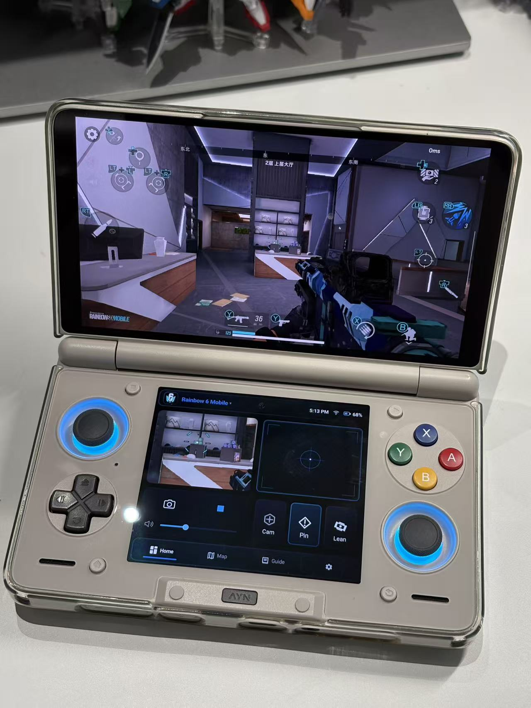
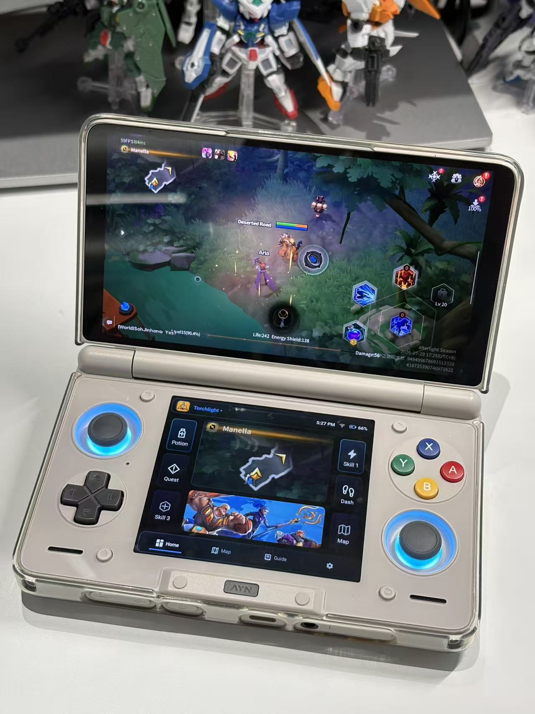
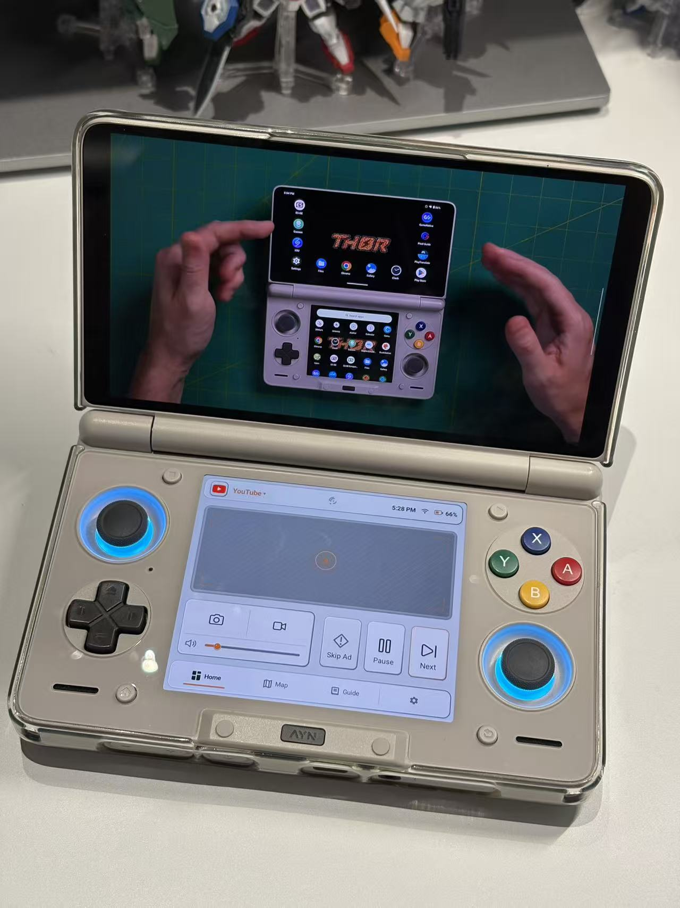

<p align="center">
  
</p>

<h1 align="center">Heimdall</h1>

<p align="center">
  专为 AYN Thor 打造的开源下屏游戏助手
</p>

<p align="center">
  <a href="https://github.com/mastercook777/Heimdall-AYN-Thor-Assistant/releases"><strong>下载 Alpha</strong></a>
  · <a href="docs/guides/Heimdall-Installation-Guide-en.pdf"><strong>English PDF Guide</strong></a>
  · <a href="docs/guides/Heimdall-Installation-Guide-zh-CN.pdf"><strong>简体中文 PDF 指南</strong></a>
  · <a href="https://github.com/mastercook777/Heimdall-AYN-Thor-Assistant/issues">反馈问题</a>
</p>

[English](README.md) | 简体中文

Heimdall 让游戏继续显示在 Thor 上屏，同时把下屏变成常驻控制与资料中心：Profile、宏、触摸控制、地图、攻略、静态图片 Canvas、放大镜、录屏和快捷操作都在拇指可及的位置。

> **Alpha 软件：** Heimdall 以 AYN Thor 为目标设备，不承诺兼容所有 Thor 固件、手柄模式、游戏、模拟器或其他双屏设备。

## Heimdall 在 AYN Thor 实机上的效果

<table>
  <tr>
    <td width="33%"></td>
    <td width="33%"></td>
    <td width="33%"></td>
  </tr>
  <tr>
    <td align="center">放大镜、精准瞄准与宏</td>
    <td align="center">放大镜、Canvas 与宏</td>
    <td align="center">快捷操作与触摸控制</td>
  </tr>
</table>

## Heimdall 能做什么

| 功能 | 用途 |
| --- | --- |
| Profile 与 Grid | 为不同游戏分别保存布局、App 绑定、触摸设置、地图、攻略和 Canvas。直接在 6 × 8 Grid 上拖动、缩放模块，再明确保存。 |
| 宏 | 通过结构化编辑器添加点击、长按、滑动、等待和实体手柄步骤，不需要手写命令。 |
| 触摸与瞄准 | 基础触控、触摸板拖动、虚拟右摇杆、精准瞄准，以及条件满足时可与 Thor 自带映射共存的 Shizuku 触控。 |
| 游戏资料 | 本地地图、PDF、攻略、Interactive Map 链接，以及每个 Profile 内多个独立的静态图片 Canvas。 |
| 上屏工具 | 上屏截图、录屏，以及每个 Profile 一个实时局部放大镜。 |

<table>
  <tr>
    <td width="50%"></td>
    <td width="50%"></td>
  </tr>
  <tr>
    <td align="center"><strong>游玩界面：</strong>下屏控制清晰、易扫视</td>
    <td align="center"><strong>编辑界面：</strong>直接拖动模块，从可见边角调整大小</td>
  </tr>
</table>

## 先看结论：安装 Heimdall 不需要开发者模式

**安装 Heimdall 不需要 Root，也不需要先进入开发者模式。** 只有玩家要使用 Shizuku 的手柄增强功能时，才需要为无线调试打开开发者选项。

| 你想使用的功能 | 需要做什么 |
| --- | --- |
| Profile、Grid、地图、攻略、Canvas 和普通界面 | 只安装 Heimdall；不需要开发者模式，也不需要 Shizuku。 |
| 向上屏发送点击、长按、滑动或兼容触摸板拖动 | 为“基础触控”启用 Heimdall 无障碍服务。 |
| 实体手柄录制/回放、虚拟右摇杆、精准瞄准或映射兼容的增强触控 | 安装、启动并授权 Shizuku；通过无线调试启动时才需要开发者模式。 |
| 实时放大镜或录屏 | 功能首次启动时，按 Android 系统提示允许屏幕捕获。 |

第一次打开 Heimdall 时不需要把所有权限一次开完。先创建一个 Profile，只配置马上要用的一条路线，测试成功后再增加功能。

## 1. 下载与安装

1. 打开 [Heimdall Releases 页面](https://github.com/mastercook777/Heimdall-AYN-Thor-Assistant/releases)。
2. 打开最新的、带固定版本号的 Alpha。
3. 下载名称类似 `heimdall-vX.Y.Z-alpha.N.apk` 的文件。同一版本还会提供 `SHA256SUMS.txt`，可用于核对文件完整性。
4. 在 Thor 的文件管理器中打开 APK。
5. 如果 Android 提示“允许此来源安装应用”，只为当前文件管理器开启安装权限，然后返回安装页面。
6. 完成安装并打开 Heimdall。

请只安装本仓库不可覆盖、带版本号的正式 Release。可变的私有开发 `debug-latest` 不是公开发行版；不要安装来源不明或被重新签名的 APK。

### 更新或从旧测试版迁移

使用同一公开签名的后续 Alpha 通常可以覆盖安装。除非发行说明明确要求，否则不要先卸载：卸载会删除本地 Profile 数据和已导入资源。

早期测试包和新的 Debug 包可能是独立 App，与公开包 `com.mastercook777.heimdall` 不共享数据。

从旧测试版迁移前：

1. 在旧版 Profile 管理中选择“导出全部 Profile”。
2. 把导出文件保存在容易找到的位置。
3. 安装并打开公开 Alpha。
4. 重新授权实际使用的服务。
5. 导入该文件；确认关键 Profile 正常后，再删除旧版或旧备份。

旧版导出的是仅含配置的 JSON；新版仍可导入，但源资源丢失时无法恢复。当前版本导出自包含 `.heimdall-profile` 迁移包，包含 Profile 数据以及受支持的 Profile 图标、地图、文件 Guide、用户宏图标和 Canvas 图片。

## 2. 创建第一个 Profile

1. 打开 **设置 > Profile 管理**。
2. 为一个常玩的游戏或模拟器创建 Profile。
3. 先在上屏启动目标 App，再从 Heimdall 的最近运行 App 中完成绑定。
4. 选择 Grid 预设。新手建议从 **Balanced（平衡）** 开始；**Controls（操控）** 为触摸控制留出更多空间，**Macros（宏）** 显示更多操作。
5. 先只添加马上要用的模块。
6. 点击设置页底部的 **保存**。
7. 回到游戏，确认 Heimdall 能选中正确的 Profile。

> **保存边界：** Grid 和部分 Profile 设置采用预览/草稿状态。看到预览不代表已经写入；离开编辑器或设置前要明确保存。

## 3. 启用基础触控（可选）

基础触控通过 Android 无障碍服务，把兼容的点击、长按、滑动和触摸板拖动发送到上屏。它不需要 Shizuku，也不需要开发者模式。

1. 在 Heimdall 中打开 **设置 > 连接**。
2. 找到 **基础触控**，点击启用操作。
3. 在 Android 无障碍设置中找到 Heimdall，阅读系统提示后开启服务。
4. 返回 Heimdall，确认基础触控显示可用。
5. 先测试一个简单点击宏或触摸板动作，再创建较长的宏。

> 基础无障碍触控和 Thor 自带按键映射使用不同的触摸流，同时操作时可能互相取消。需要共存时，只在 Heimdall 明确显示可用的情况下使用映射兼容的增强触控路线。

## 4. 为控制器增强配置 Shizuku（可选）

实体手柄录制/回放、虚拟右摇杆、精准瞄准和映射兼容的增强触控需要 Shizuku。Heimdall 本身不需要 Root。

- [Shizuku 官方 Releases](https://github.com/RikkaApps/Shizuku/releases)
- [Shizuku 官方中文设置指南](https://shizuku.rikka.app/zh-hans/guide/setup/)

### 从来没有开过开发者模式？按下面做

不同 Thor 固件的 Android 菜单名称可能略有区别。如果找不到某一项，可以直接使用系统设置顶部的搜索框，搜索“版本号”“开发者选项”或“无线调试”。

1. 打开 Thor 的 **Android 系统设置**。
2. 进入 **关于设备**、**关于掌机**，或名称相近的页面。
3. 找到 **版本号 / Build number**。部分固件会把它放在“软件信息”或“版本信息”里面。
4. **连续点击版本号 7 次。**
5. 如果系统要求，输入锁屏密码。随后应出现“您已处于开发者模式”之类的提示。
6. 返回 **系统 > 开发者选项**；如果仍找不到，就在系统设置中搜索“开发者选项”。
7. 开启 **USB 调试**。
8. 进入 **无线调试**，打开无线调试开关。

至此开发者选项已经开启。这八步通常只需要做一次。

### 配对并启动 Shizuku

1. 安装并打开 Shizuku。
2. 选择 **通过无线调试启动**，然后开始配对。
3. 返回 Android 的 **无线调试** 页面。
4. 选择 **使用配对码配对设备**。
5. 把系统显示的配对码输入 Shizuku 通知或配对页面。
6. 返回 Shizuku，点击 **启动**，等待状态显示 Shizuku 正在运行。
7. 打开 **Heimdall > 设置 > 连接 > 控制器增强**。
8. 点击授权/连接，在 Shizuku 授权窗口中允许 Heimdall。
9. 返回 Heimdall，确认控制器增强显示可用。

Thor 重启后，在使用控制器功能前先检查 Shizuku 状态。如果服务已经停止，需要重新点击启动；通常不需要再次配对。

如果 Shizuku 一直显示“正在搜索配对服务”，请允许它在后台运行并开启通知，保持本地网络和无线调试可用，然后尝试关闭再重新开启一次无线调试。不同系统的最新处理方式请参考 [Shizuku 官方中文手册](https://shizuku.rikka.app/zh-hans/guide/setup/)。

## 5. 开始使用 Heimdall

### Grid 与模块

在可视化 Grid 编辑器中添加、拖动、缩放或删除模块；模块会吸附到 6 × 8 Grid。先预览，再明确保存 Grid 和当前 Profile。

### 触摸宏

1. 在 Grid 中添加宏模块。
2. 长按宏按钮约 1.8 秒，打开结构化编辑器。
3. 添加点击、长按、滑动或等待步骤。
4. 捕获坐标时，直接在上屏目标位置操作。
5. 保存宏，返回主界面，单击按钮执行。

### 实体手柄宏

控制器录制和回放需要 Shizuku 与可用的控制器增强路线。Thor 自带映射可能使已经映射的物理按键无法进入 Heimdall 录制流。遇到这种情况时，可以开始录制后暂时回到 Android 桌面按下目标按键，再返回 Heimdall 检查并保存序列。

增强触控模式不会回放包含实体手柄步骤的宏。Heimdall 会先提示切换触控模式，而不是悄悄改用另一条输入路线。

### 触摸板、虚拟右摇杆与精准瞄准

- **触摸拖动：** 把下屏手指移动转换为上屏拖动。
- **虚拟右摇杆：** 通过控制器增强发送 Thor 右摇杆输入；松手后应立即回中。
- **精准瞄准：** 用于小幅视角修正。建议从低灵敏度开始，大幅转向继续使用物理摇杆。

### 放大镜、地图、攻略与 Canvas

- 在 Grid 中添加放大镜，按 Android 提示允许屏幕捕获，然后选择上屏区域。长按模块可以重新选区。每个 Profile 当前支持一个实时放大镜，且不能与录屏同时运行。
- 地图与攻略属于当前 Profile，可以保存本地图片、PDF、文本或 Interactive Map 地址。
- Canvas 用于显示静态 JPG、PNG 或 WebP 资料。一个 Profile 可以添加多个独立 Canvas；双击进入全屏查看，长按更换图片或调整构图。

### 截图与录屏

Quick Actions 可以捕获上屏。录屏使用 Android MediaProjection 和 Audio Playback Capture，而不是麦克风输入；上屏应用仍可以禁止自身游戏声音被捕获。

## 6. 卸载前先备份

完成重要 Grid 或宏配置后，进入 Profile 管理导出当前或全部 Profile，并在 Heimdall 之外保存副本。`.heimdall-profile` 会自包含受支持的 Profile 资源，并在导入前完成完整校验。Heimdall 会为部分破坏性 Profile 操作保留有限恢复快照，但自动快照不能代替手动导出。格式细节见 [Profile 迁移包格式](docs/PROFILE_BUNDLE_FORMAT.md)。

Alpha 默认关闭 Android 平台备份。卸载应用会删除 Heimdall 本地数据。

## Alpha 已知限制

- 映射兼容的 Shizuku 触控只在已测试的 Thor、固件、游戏和映射组合上完成验证；其他固件可能显示不可用。
- 基础无障碍触控与 Thor 自带按键映射同时操作时可能互相取消。
- Thor 映射可能隐藏宏录制需要的已映射实体按键。
- 每个 Profile 当前只支持一个实时放大镜；放大镜不能与录屏共享 MediaProjection。
- 从其他下屏 Tab 返回 Main 后，冻结画面的 Stop 标记偶尔可能不显示；停止后也可能保留最后一帧。这是已知显示状态问题，不代表画面仍在实时更新。

完整测试范围、迁移说明和限制请阅读 [v0.1.0-alpha.1 发行说明](docs/releases/v0.1.0-alpha.1.md)。

## 如何提供有效反馈

请通过 [GitHub Issues](https://github.com/mastercook777/Heimdall-AYN-Thor-Assistant/issues) 反馈，并尽量附上：

- Heimdall 版本与 Thor 固件版本。
- 手柄模式：原生 / Xbox。
- 游戏或模拟器名称。
- 使用的路线：基础触控 / Shizuku。
- 是否开启 Thor 自带按键映射。
- 完整复现步骤和出现频率。
- 可以提供时附上截图或录屏。
- 重启 Heimdall、重启 Shizuku 或重新授权后结果是否变化。

<details>
<summary><strong>从源码构建</strong></summary>

要求：

- JDK 17
- Android SDK 35
- CMake 3.22.1
- Android NDK `30.0.14904198`

构建 Debug APK：

```text
./gradlew :assistant:assembleDebug --no-daemon
```

运行 Alpha 使用的同类静态检查：

```text
./gradlew :assistant:lintDebug --no-daemon
```

公开仓库不包含签名密钥。本地 Debug 使用 Android 开发签名；公开 Alpha 只由受 Tag 约束的发布工作流配合外部私有签名密钥生成。

</details>

## 数据、隐私与贡献

除非玩家主动导入或导出，Profile 数据只保存在设备本地。联网权限用于玩家自行配置的 Interactive Map 页面；Heimdall 不会向这些页面暴露 JavaScript 接口。详见 [docs/PRIVACY.zh-CN.md](docs/PRIVACY.zh-CN.md)。

提交更改前请阅读 [CONTRIBUTING.md](CONTRIBUTING.md)（英语）。原生输入、跨屏路由、MediaProjection、性能和实体操作体验都需要范围明确的 AYN Thor 实机证据。

## 许可证

Heimdall 源码采用 Apache License 2.0，详见 [LICENSE](LICENSE)、[NOTICE](NOTICE) 和 [THIRD_PARTY_NOTICES.md](THIRD_PARTY_NOTICES.md)。

AYN 与 Thor 是其各自权利人的商标。Heimdall 是社区项目，不代表 AYN 官方应用。
